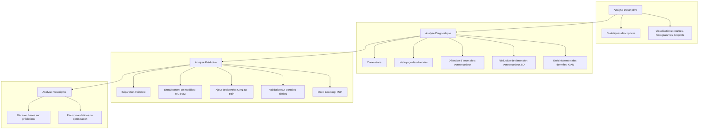

# Autoencodeurs & GANs : Génération et Reconstitution de Données

## Étude de cas : Prédiction de la maladie d'Alzheimer avec des modèles génératifs

### Source des données
- Kaggle : [Alzheimer's Disease Dataset](https://www.kaggle.com/datasets/rabieelkharoua/alzheimers-disease-dataset)

---

## 🧠 **Contexte**

La maladie d'Alzheimer, pathologie neurodégénérative, nécessite un diagnostic précoce pour optimiser la prise en charge et la recherche thérapeutique. Le dataset utilisé ici propose des données synthétiques riches en variables démographiques, cliniques et comportementales, permettant de modéliser et prédire la présence ou les stades de la maladie.

Chaque entrée représente un patient, décrit par de nombreux facteurs (âge, antécédents, mode de vie, scores cognitifs, symptômes, etc.). La variable cible concerne le diagnostic ou le stade de la maladie.

---

## 🎯 **Objectifs du projet**

- **Classification** : Prédire la présence ou le stade de la maladie d'Alzheimer à partir des caractéristiques fournies.
- **Génération de données** : Utiliser des autoencodeurs et des GANs pour générer ou reconstituer des données synthétiques similaires à celles des patients, dans un but d’augmentation ou d’analyse de la variabilité des données.
- **Détection d’anomalies** : Identifier des profils atypiques ou à risque à l’aide des modèles génératifs.

---

## 🛠️ **Méthodologie**

Le projet suit les étapes suivantes, illustrant la chaîne complète d'analyse de données :

---

## 📁 **Structure du projet**

- `autoencoder.ipynb` : Notebook principal contenant le code, l’analyse et les visualisations.
- `README.md` : Présentation du projet, contexte, objectifs et instructions.
- `data.csv` : Dossier pour les données téléchargées.

---

## 🚀 **Utilisation**

1. **Télécharger le dataset** depuis Kaggle et le placer dans le dossier `data.csv`.
2. **Ouvrir le notebook** `autoencoder.ipynb` avec Jupyter ou VSCode.
3. **Exécuter les cellules** du notebook pour reproduire les étapes de prétraitement, modélisation et visualisation.
4. **Adapter les hyperparamètres** ou architectures selon les besoins (paramètres à modifier dans le notebook).

---

## 📝 **Références**

- [Alzheimer’s Disease Dataset (Kaggle)](https://www.kaggle.com/datasets/rabieelkharoua/alzheimers-disease-dataset)
- Bonnes pratiques sur les autoencodeurs et les GANs.
- Documentation des frameworks utilisés (PyTorch, Tensorflow, etc.)

---

## 📫 Contact

Pour toute question ou contribution :

- Auteur : **bradlab**
- Email : `matbradiouf@gmail.com`
- GitHub : [https://github.com/bradlab](https://github.com/bradlab)

---

## 📜 **Licence**

Ce projet est proposé à titre éducatif. Respecter la licence des données Kaggle.
